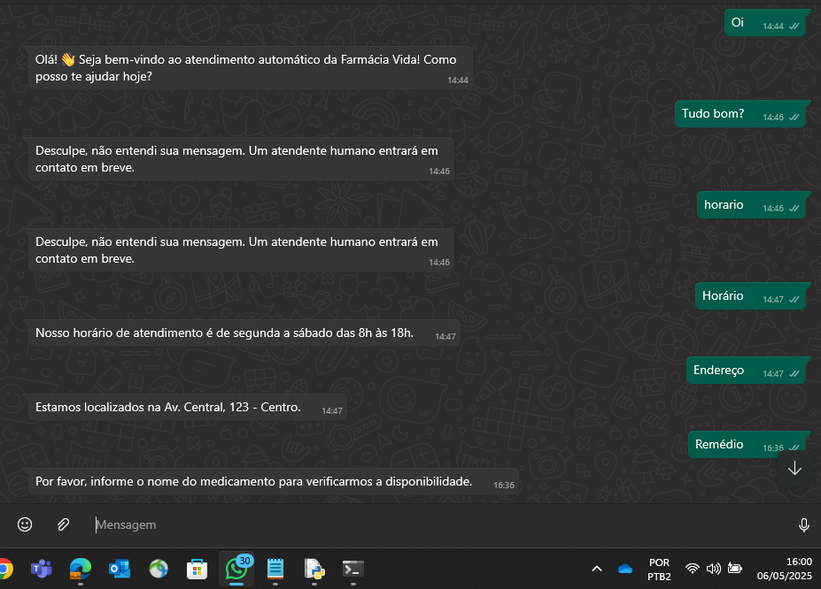

# 🤖 Bot WhatsApp com IA (Dialogflow) 🚀


Projeto concluído e funcional: bot automatizado para WhatsApp, capaz de atender clientes automaticamente, responder dúvidas frequentes e personalizar respostas usando inteligência artificial.

- **Flask** (para criar a API)
- **Twilio** (para integração com WhatsApp)
- **Dialogflow** (para inteligência artificial e NLP)

💬 **Funcionalidades:**

- Atende automaticamente clientes pelo WhatsApp
- Responde a perguntas frequentes (horários, localização, etc.)
- Usa inteligência artificial para interpretar e responder mensagens

## 🖼️ Exemplo do Bot em Ação




---

## 🚀 Tecnologias Utilizadas:

- Python
- Flask
- Twilio API
- Dialogflow (Google Cloud)

---

## 📦 Como Rodar Localmente:

1️⃣ Clone o repositório:

```bash
git clone https://github.com/FrancWash/whatsapp-bot-ia.git

2️⃣ Instale as dependências:
pip install -r requirements.txt

3️⃣ Configure a chave do Dialogflow:

Baixe sua chave JSON da Google Cloud.

Salve na raiz do projeto e configure no código.

4️⃣ Rode o bot localmente:
python bot_whatsapp.py

5️⃣ Exponha o bot usando Ngrok ou LocalTunnel:
ngrok http 5000

6️⃣ Configure o webhook no Twilio com a URL + /whatsapp

## 📈 Próximos Passos

- Customização para diferentes nichos (academias, igrejas, comércio local e etc...)
- Melhorias no NLP com modelos mais avançados
- Criação de interface para configuração das respostas
- Oferecer serviço como SaaS (Software as a Service)

🙌 Autor
Franc Washington Vilela

📩 E-mail: fvilela216@gmail.com  
📲 WhatsApp: +55 11 97847-4481  
🔗 [LinkedIn](https://www.linkedin.com/in/https://www.linkedin.com/in/franc-washington-vilela-12446016a/)


⚠️ Aviso
Este projeto foi desenvolvido com fins educacionais e demonstração. Para uso em produção, recomenda-se validação adicional de segurança e escalabilidade.


